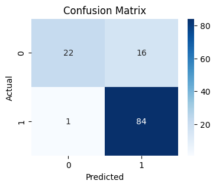

# Loan Approval Prediction App

This project is a **Loan Approval Prediction** web application built using **Python**, **scikit-learn**, and **Streamlit**. It predicts whether a loan application will be approved based on applicant details.

---

## 📋 Project Overview

* **Goal:** Build a machine learning model to predict loan approval status using applicant financial and demographic data.
* **Dataset:** Loan prediction dataset with features like income, loan amount, credit history, education, employment, property area, etc.
* **Final Model:** Logistic Regression classifier chosen for its simplicity and interpretability.
* **App:** Interactive web app to input user data and display loan approval prediction along with probability.

---

## 🗂️ Dataset & Preprocessing

* Data contains numeric and categorical features with some missing values.
* Missing numeric values filled with median; missing categorical values filled with mode.
* Categorical features encoded using One-Hot Encoding.
* Numeric features scaled using StandardScaler.
* Class imbalance addressed by oversampling minority class using **SMOTE**.
* Dataset split into training and testing sets with stratification.

---

## ⚙️ Model Training

* Multiple models including Logistic Regression, Random Forest, and XGBoost were tested.
* Logistic Regression was selected as the final model based on balanced performance and simplicity.
* The model was trained on oversampled data to handle class imbalance.

---

## 🔧 Final Pipeline

* Preprocessing steps (imputation, scaling, encoding) combined with Logistic Regression in a single scikit-learn **Pipeline**.
* The pipeline is trained on oversampled data but fitted on original training data for inference.
* The final pipeline saved as `loan_approval_final_pipeline.pkl` using `joblib`.

---

## 🚀 Streamlit Application

* Simple, user-friendly interface to input applicant details such as:

  * Gender
  * Marital Status
  * Number of Dependents
  * Education Level
  * Self Employment Status
  * Applicant and Coapplicant Income
  * Loan Amount and Term
  * Credit History
  * Property Area
* On clicking "Predict Loan Approval", the app processes inputs through the saved pipeline and shows approval status along with the predicted probability.
* Deployed locally and easily deployable on cloud platforms.

---

## 📈 Evaluation Metrics

| Metric    | Score (Logistic Regression) |
| --------- | --------------------------- |
| Accuracy  | 0.86                        |
| ROC AUC   | 0.85                        |

#### Logistic Regression - Confusion Matrix 


Confusion matrices and detailed classification reports are available during model evaluation.


---

## 🛠️ How to Run

1. Clone this repo:

   ```bash
   git clone https://github.com/AhemazizSingh/Loan-Approval-Prediction.git
   cd Loan-Approval-Prediction
   ```

2. Create and activate a virtual environment:

   ```bash
   python -m venv venv\
   .\venv\Scripts\activate   
   ```

3. Install dependencies:

   ```bash
   pip install -r requirements.txt
   ```

4. Run the Streamlit app:

   ```bash
   streamlit run app.py
   ```

---

## 📦 Requirements

* Python 3.8+
* scikit-learn
* imblearn
* pandas
* numpy
* streamlit
* joblib
* matplotlib
* seaborn
* xgboost

---
